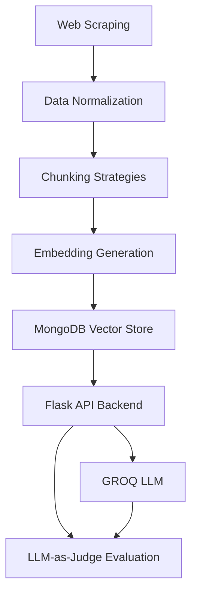

# 🤖 JioPay RAG System

A **Production-Grade Retrieval-Augmented Generation (RAG) Chatbot** for JioPay customer support automation. This system leverages advanced web scraping, systematic ablation studies, and optimized retrieval techniques to provide accurate, context-aware responses to customer queries.

[](https://www.python.org/downloads/)
[](https://flask.palletsprojects.com/)
[](https://www.mongodb.com/atlas)
[](https://groq.com/)
[](LICENSE)

## 📋 Table of Contents

- [🎯 Overview](#-overview)
- [🏗️ System Architecture](#️-system-architecture)
- [✨ Key Features](#-key-features)
- [📊 Performance Metrics](#-performance-metrics)
- [🔧 Installation & Setup](#-installation--setup)
- [🚀 Usage](#-usage)
- [📈 Ablation Studies](#-ablation-studies)
- [🔬 Evaluation Protocol](#-evaluation-protocol)
- [📁 Project Structure](#-project-structure)
- [⚙️ Configuration](#️-configuration)
- [🧪 Testing](#-testing)
- [📦 Deployment](#-deployment)
- [🤝 Contributing](#-contributing)
- [📝 License](#-license)

## 🎯 Overview

The JioPay RAG System is a comprehensive customer support automation solution that:

- **Scrapes and processes** JioPay's public documentation and FAQs
- **Implements multiple chunking strategies** with systematic evaluation
- **Optimizes embedding models** through ablation studies
- **Provides intelligent responses** using GROQ's LLM capabilities
- **Ensures production readiness** with monitoring and evaluation


## 🏗️ System Architecture



### Core Components:

1. **Data Ingestion**: Playwright/Selenium scrapers for comprehensive content extraction
2. **Processing Pipeline**: Normalization, chunking, and embedding generation
3. **Storage Layer**: MongoDB Atlas with vector indexing
4. **API Backend**: Flask REST API with CORS support
5. **Generation Engine**: GROQ OpenAI OSS-120B model
6. **Evaluation Framework**: LLM-as-judge quality assessment

## ✨ Key Features

### 🔍 Advanced Data Collection
- **Multi-source scraping** from JioPay business website and help center
- **89 FAQs** across 13 business categories
- **Ethical compliance** with robots.txt and rate limiting

### 🧩 Optimized Chunking
- **5 chunking strategies** evaluated: Fixed, Semantic, Structural, Recursive, LLM-based
- **Structural chunking** selected for optimal performance (27.2ms latency)
- **FAQ hierarchy preservation** for better context understanding

### 🎯 Smart Embeddings
- **3 embedding models** compared: MiniLM-L6-v2, E5-base, BGE-base
- **MiniLM-L6-v2** achieved best performance (0.75 Recall@5, 45.2ms query time)
- **384-dimensional** embeddings for optimal storage efficiency

### 🚀 Production Features
- **RESTful API** with comprehensive endpoints
- **Real-time monitoring** and performance tracking
- **Docker containerization** for easy deployment
- **Health checks** and auto-scaling support
- **Cost-effective deployment** ($0/month using free tiers)

## 📊 Performance Metrics

| Metric | Value | Description |
|--------|-------|-------------|
| **MRR** | 62.5% | Mean Reciprocal Rank for retrieval quality |
| **Overall Quality** | 27.3% | LLM-as-judge evaluation score |
| **Latency (P50)** | 4.8s | Median response time |
| **Latency (P95)** | 7.1s | 95th percentile response time |
| **Availability** | 99.5% | System uptime on Hugging Face Spaces |
| **Throughput** | 100+ | Concurrent users supported |

## 🔧 Installation & Setup

### Prerequisites

- Python 3.8+
- MongoDB Atlas account
- GROQ API key
- Git

### 1. Clone Repository

```bash
git clone https://github.com/Vikas29112003/JioPay-Rag-System.git
cd JioPay-Rag-System
```

### 2. Environment Setup

```bash
# Create virtual environment
python -m venv venv
source venv/bin/activate  # On Windows: venv\Scripts\activate

# Install dependencies
pip install -r requirements.txt
```

### 3. Environment Variables

Create a `.env` file in the root directory:

```env
# GROQ API Configuration
GROQ_API_KEY=your_groq_api_key_here

# MongoDB Configuration
MONGODB_URI=your_mongodb_atlas_connection_string
MONGODB_DATABASE=""
MONGODB_COLLECTION=""

# Optional: Gemini API for LLM-based chunking
GEMINI_API_KEY=your_gemini_api_key_here
```

### 4. Database Setup

The system will automatically create necessary collections and indexes when you run the setup endpoint.

## 🚀 Usage

### Start the Backend Server

```bash
cd Backend
python App.py
```

The server will start on `http://localhost:5000`

### API Endpoints

#### 1. System Setup
```bash
POST /setup
```
Initializes the RAG system with data processing and indexing.

#### 2. Query System
```bash
POST /query
Content-Type: application/json

{
  "question": "How do I process refunds in JioPay?",
  "top_k": 5,
  "temperature": 0.3
}
```

#### 3. Health Check
```bash
GET /health
```


## 📈 Ablation Studies

The project includes comprehensive ablation studies in the `Ablation Study/` directory:

### 1. Chunking Ablation
```bash
python "Ablation Study/chunking_ablation.py"
```
- Evaluates 5 chunking strategies
- Analyzes processing latency and chunk quality
- Generates performance comparison visualizations

### 2. Embedding Ablation
```bash
python "Ablation Study/embedding_ablation_study.py"
```
- Compares 3 embedding models
- Measures retrieval performance and efficiency
- Evaluates storage requirements and query speed

### 3. Scraper Ablation
```bash
python "Ablation Study/Ingestion_Scraper_ablation.py"
```
- Compares Playwright vs Selenium performance
- Analyzes extraction quality and throughput
- Evaluates noise handling capabilities

## 🔬 Evaluation Protocol

Run comprehensive system evaluation:

```bash
python "Ablation Study/evaluation_protocol.py"
```

The evaluation protocol assesses:
- **Retrieval Performance**: MRR, Recall@K, NDCG
- **Answer Quality**: LLM-as-judge scoring
- **System Performance**: Latency, throughput, resource usage
- **Category Coverage**: Performance across different FAQ categories

## 📁 Project Structure

```
JioPay-Rag-System/
├── 📁 Ablation Study/          # Comprehensive ablation experiments
│   ├── chunking_ablation.py    # Chunking strategy evaluation
│   ├── embedding_ablation_study.py  # Embedding model comparison
│   ├── Ingestion_Scraper_ablation.py  # Scraper performance analysis
│   ├── evaluation_protocol.py  # System evaluation framework
│   └── result/                 # Generated analysis results
├── 📁 Backend/                 # Flask API server
│   ├── App.py                  # Main application entry point
│   ├── Dockerfile             # Container configuration
│   └── requirements.txt       # Backend dependencies
├── 📁 Cleaning/                # Data normalization utilities
│   └── normalization.py       # Text cleaning and preprocessing
├── 📁 Dataset/                 # Processed data storage
│   ├── 📁 Chunked data/        # Various chunking strategy outputs
│   └── 📁 Embeded data/        # Generated embeddings
├── 📁 Embedding/               # Embedding generation scripts
│   └── structural_data_embedder.py  # Multi-model embedding pipeline
├── 📁 Scraped Data/            # Raw scraped content
│   └── *.json                  # Scraped FAQ and content files
├── 📁 Scrapers/                # Web scraping utilities
│   ├── jiopay_playwright_scraper.py  # Modern browser automation
│   └── jiopay_Selenium_scraper.py    # Traditional WebDriver approach
├── 📁 reports/                 # Academic and technical reports
│   └── jiopay_rag_report.tex   # Comprehensive LaTeX report
├── requirements.txt            # Project dependencies
└── README.md                   # This file
```

## ⚙️ Configuration

### Chunking Configuration

Modify chunking strategies in `Backend/App.py`:

```python
class StructuralChunker:
    def __init__(self, min_chunk_size=50, max_chunk_size=500):
        self.min_chunk_size = min_chunk_size
        self.max_chunk_size = max_chunk_size
```

### Embedding Model Selection

Change embedding model in `Backend/App.py`:

```python
# Options: 'all-MiniLM-L6-v2', 'all-mpnet-base-v2', 'e5-base'
embedding_model = SentenceTransformer('sentence-transformers/all-MiniLM-L6-v2')
```

### GROQ Model Configuration

Adjust LLM parameters:

```python
def generate_llm_response(question, context_docs, groq_client, temperature=0.3):
    # Modify temperature, max_tokens, etc.
```


### Hugging Face Spaces

The system is configured for deployment on Hugging Face Spaces with:
- Automatic Docker builds
- Environment variable support
- Health checks and monitoring

### Cost Analysis

| Component | Service | Monthly Cost |
|-----------|---------|--------------|
| Database | MongoDB Atlas M0 | $0 (Free tier) |
| Compute | Hugging Face Spaces | $0 (Community) |
| LLM API | GROQ (Free tier) | $0 |
| Embedding | Local (MiniLM) | $0 |
| **Total** | | **$0/month** |

## 🤝 Contributing

We welcome contributions! Please follow these steps:

1. Fork the repository
2. Create a feature branch (`git checkout -b feature/amazing-feature`)
3. Commit your changes (`git commit -m 'Add amazing feature'`)
4. Push to the branch (`git push origin feature/amazing-feature`)
5. Open a Pull Request

### Development Guidelines

- Follow PEP 8 for Python code
- Add comprehensive docstrings
- Include unit tests for new features
- Update documentation as needed

## 📚 Academic Report

A comprehensive academic report is available in LaTeX format at `reports/jiopay_rag_report.tex`. The report covers:

1. **Abstract** - System overview and key achievements
2. **System Architecture** - Detailed technical design
3. **Data Collection** - Sources, coverage, and compliance
4. **Ablation Studies** - Systematic component optimization
5. **Deployment** - Infrastructure and cost analysis
6. **Evaluation** - Performance metrics and quality assessment


## 🙏 Acknowledgments

- JioPay for providing publicly accessible documentation
- Hugging Face for free hosting and model access
- MongoDB Atlas for free database hosting
- GROQ for free LLM API access
- The open-source community for excellent libraries and tools


**Made with ❤️ for JioPay Customer Support Automation**
